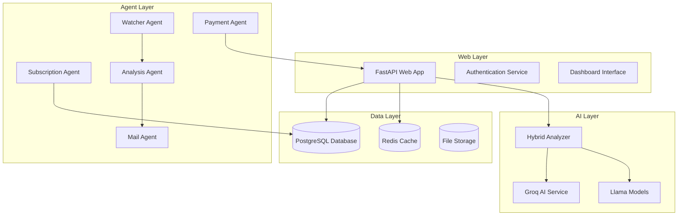
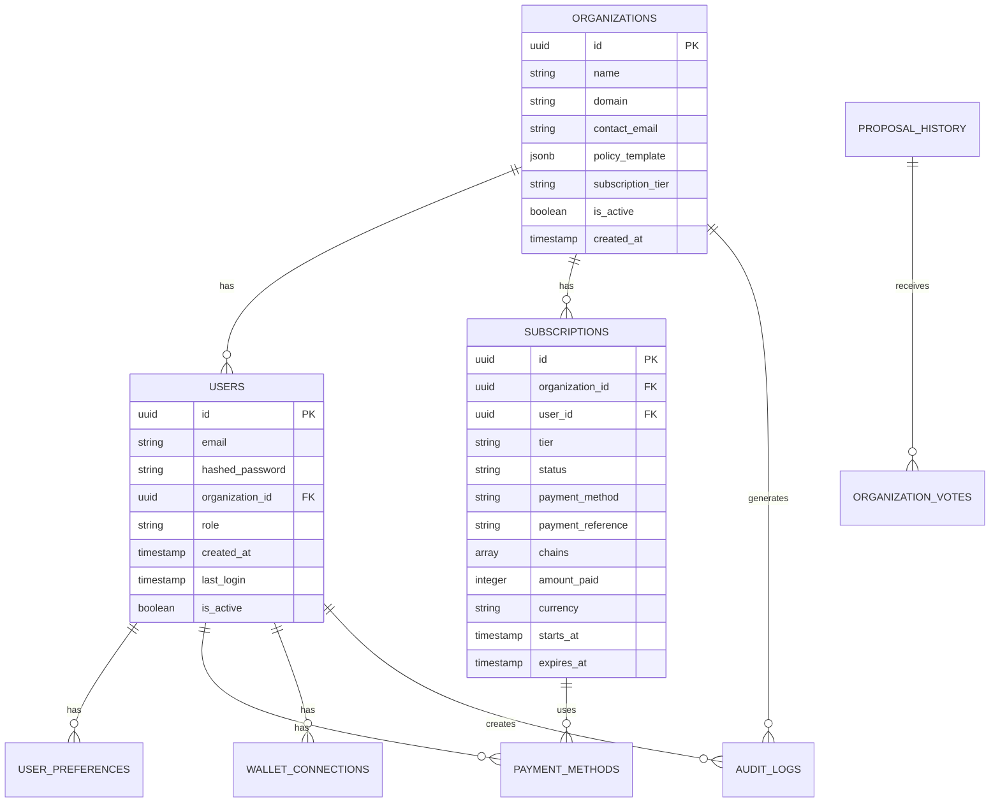
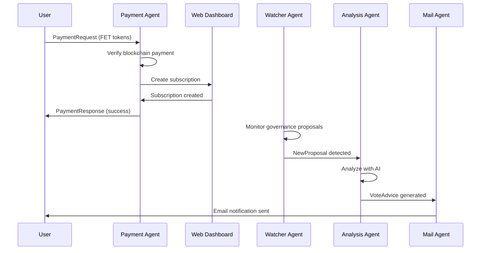
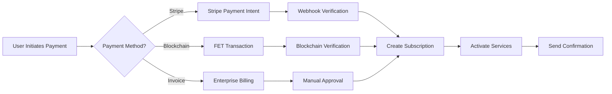

# 📊 Cosmos GRC Co-Pilot - Data Model Documentation
## Complete System Architecture & Database Schema

**Version**: 3.0.0  
**Last Updated**: July 2025  
**Deployment**: Vultr Track Enterprise GRC Platform  

---

## 📋 Table of Contents

1. [🏗️ System Architecture Overview](#-system-architecture-overview)
2. [🗄️ Database Models](#-database-models)
3. [📝 Pydantic Models](#-pydantic-models)
4. [🔧 Main Function Signatures](#-main-function-signatures)
5. [🔗 Data Relationships](#-data-relationships)
6. [📊 Database Schema](#-database-schema)
7. [🤖 Agent Models](#-agent-models)
8. [💳 Payment Models](#-payment-models)
9. [🔍 API Endpoints](#-api-endpoints)

---

## 🏗️ System Architecture Overview

### Core Components


---

## 🗄️ Database Models

### Primary Tables Structure

| Table | Purpose | Key Relationships | Records |
|-------|---------|------------------|---------|
| **organizations** | Organization management | → users, subscriptions | ~1K-10K |
| **users** | User accounts & auth | organizations ← → audit_logs | ~5K-50K |
| **subscriptions** | Payment & service tracking | organizations ← | ~1K-10K |
| **proposal_history** | Governance proposals | → organization_votes | ~100K+ |
| **user_preferences** | AI learning data | users ← | ~5K-50K |
| **audit_logs** | Compliance tracking | users ←, organizations ← | ~1M+ |

### 1. Organizations Table

**Primary Entity**: Enterprise organizations using the platform

```sql
CREATE TABLE organizations (
    id UUID PRIMARY KEY DEFAULT uuid_generate_v4(),
    name VARCHAR(255) NOT NULL,
    domain VARCHAR(255) NOT NULL UNIQUE,
    contact_email VARCHAR(255) NOT NULL,
    created_at TIMESTAMP DEFAULT CURRENT_TIMESTAMP,
    policy_template JSONB DEFAULT '{}',
    subscription_tier VARCHAR(50) DEFAULT 'basic',
    is_active BOOLEAN DEFAULT true
);
```

**SQLAlchemy Model**:
```python
class Organization(Base):
    __tablename__ = "organizations"
    
    id = Column(String, primary_key=True, index=True)
    name = Column(String, nullable=False)
    domain = Column(String, nullable=False)
    contact_email = Column(String, nullable=False)
    created_at = Column(DateTime, default=datetime.utcnow)
    policy_template = Column(JSON, default=dict)
    subscription_tier = Column(String, default="basic")
    is_active = Column(Boolean, default=True)
```

**Fields Description**:
- `id`: Unique organization identifier
- `name`: Organization display name
- `domain`: Email domain for user verification
- `contact_email`: Primary contact for billing/support
- `policy_template`: JSON governance policy configuration
- `subscription_tier`: `basic` | `professional` | `enterprise`
- `is_active`: Organization status flag

### 2. Users Table

**Primary Entity**: Individual user accounts within organizations

```sql
CREATE TABLE users (
    id UUID PRIMARY KEY DEFAULT uuid_generate_v4(),
    email VARCHAR(255) UNIQUE NOT NULL,
    hashed_password VARCHAR(255) NOT NULL,
    organization_id UUID REFERENCES organizations(id),
    role VARCHAR(50) DEFAULT 'user',
    created_at TIMESTAMP DEFAULT CURRENT_TIMESTAMP,
    last_login TIMESTAMP,
    is_active BOOLEAN DEFAULT true
);
```

**Fields Description**:
- `role`: `user` | `admin` | `super_admin`
- `hashed_password`: bcrypt hashed password
- `organization_id`: Foreign key to organizations
- `last_login`: Track user activity

### 3. Subscriptions Table

**Primary Entity**: Service subscriptions and payment tracking

```sql
CREATE TABLE subscriptions (
    id UUID PRIMARY KEY DEFAULT uuid_generate_v4(),
    organization_id UUID REFERENCES organizations(id),
    user_id UUID REFERENCES users(id),
    tier VARCHAR(50) NOT NULL,
    status VARCHAR(50) NOT NULL,
    payment_method VARCHAR(50) NOT NULL,
    payment_reference VARCHAR(255),
    chains TEXT[] DEFAULT '{}',
    amount_paid INTEGER DEFAULT 0,
    currency VARCHAR(10) DEFAULT 'USD',
    starts_at TIMESTAMP DEFAULT CURRENT_TIMESTAMP,
    expires_at TIMESTAMP,
    created_at TIMESTAMP DEFAULT CURRENT_TIMESTAMP,
    updated_at TIMESTAMP DEFAULT CURRENT_TIMESTAMP
);
```

**Fields Description**:
- `tier`: `basic` | `professional` | `enterprise`
- `status`: `active` | `expired` | `cancelled` | `pending`
- `payment_method`: `stripe` | `blockchain` | `invoice`
- `payment_reference`: Stripe payment intent ID or blockchain tx hash
- `chains`: Array of monitored chain IDs
- `amount_paid`: Amount in cents (USD) or smallest unit (FET)

### 4. Proposal History Table

**Primary Entity**: Governance proposals from all chains

```sql
CREATE TABLE proposal_history (
    id UUID PRIMARY KEY DEFAULT uuid_generate_v4(),
    chain_id VARCHAR(50) NOT NULL,
    proposal_id VARCHAR(50) NOT NULL,
    title TEXT NOT NULL,
    description TEXT,
    status VARCHAR(50) NOT NULL,
    voting_start TIMESTAMP,
    voting_end TIMESTAMP,
    ai_analysis JSONB,
    organization_votes JSONB DEFAULT '{}',
    created_at TIMESTAMP DEFAULT CURRENT_TIMESTAMP,
    UNIQUE(chain_id, proposal_id)
);
```

**AI Analysis JSON Structure**:
```json
{
    "provider": "groq|llama|hybrid",
    "recommendation": "APPROVE|REJECT|ABSTAIN",
    "confidence": 85,
    "reasoning": "Detailed analysis...",
    "risk_assessment": "LOW|MEDIUM|HIGH",
    "policy_alignment": 87,
    "timestamp": "2025-07-05T10:30:00Z"
}
```

### 5. Payment & Wallet Models

```sql
CREATE TABLE payment_methods (
    id UUID PRIMARY KEY DEFAULT uuid_generate_v4(),
    user_id UUID REFERENCES users(id),
    method_type VARCHAR(50) NOT NULL,
    provider_id VARCHAR(255),
    extra_data JSONB DEFAULT '{}',
    is_active BOOLEAN DEFAULT true,
    created_at TIMESTAMP DEFAULT CURRENT_TIMESTAMP
);

CREATE TABLE wallet_connections (
    id UUID PRIMARY KEY DEFAULT uuid_generate_v4(),
    user_id UUID REFERENCES users(id),
    wallet_address VARCHAR(255) NOT NULL,
    wallet_type VARCHAR(50) NOT NULL,
    chain_id VARCHAR(50) NOT NULL,
    is_verified BOOLEAN DEFAULT false,
    verification_signature VARCHAR(512),
    connected_at TIMESTAMP DEFAULT CURRENT_TIMESTAMP
);
```

---

## 📝 Pydantic Models

### Core Business Models

#### 1. SubConfig Model
```python
class SubConfig(BaseModel):
    """Subscription configuration for user registration"""
    email: EmailStr = Field(..., description="User's verified email")
    chains: List[str] = Field(..., min_length=1, description="Chain IDs to monitor")
    policy_blurbs: List[str] = Field(..., min_length=1, description="Policy preferences")
    
    @field_validator('chains')
    @classmethod
    def validate_chains(cls, v):
        return [chain.strip().lower() for chain in v]

#### 1.1 Web Application Models
```python
class PolicyTemplate(BaseModel):
    """Governance policy template configuration"""
    name: str
    description: str
    voting_criteria: Dict[str, Any]
    risk_tolerance: str  # LOW, MEDIUM, HIGH
    notification_preferences: Dict[str, Any]

class VoteDecision(BaseModel):
    """User vote decision from web interface"""
    proposal_id: str
    chain_id: str
    decision: str  # approve, reject, abstain
    reasoning: str

class LoginRequest(BaseModel):
    """User login request"""
    email: EmailStr
    password: str

class KeplrAuthRequest(BaseModel):
    """Keplr wallet authentication request"""
    wallet_address: str
    signature: str
    message: str
    chain_id: str
```

#### 2. NewProposal Model
```python
class NewProposal(BaseModel):
    """New governance proposal detected by WatcherAgent"""
    chain: str = Field(..., description="Cosmos chain ID")
    proposal_id: int = Field(..., ge=1, description="Unique proposal ID")
    title: str = Field(..., min_length=1, description="Proposal title")
    description: str = Field(..., min_length=10, description="Proposal content")
    voting_start_time: Optional[int] = Field(None, description="Start timestamp")
    voting_end_time: Optional[int] = Field(None, description="End timestamp")
```

#### 3. VoteAdvice Model
```python
class VoteAdvice(BaseModel):
    """AI-generated voting recommendation"""
    chain: str = Field(..., description="Cosmos chain ID")
    proposal_id: int = Field(..., ge=1, description="Proposal ID")
    target_wallet: str = Field(..., description="Target subscriber wallet")
    target_email: EmailStr = Field(..., description="Target email")
    decision: str = Field(..., pattern="^(YES|NO|ABSTAIN)$", description="Vote decision")
    rationale: str = Field(..., min_length=50, description="AI reasoning")
    confidence: float = Field(default=0.5, ge=0.0, le=1.0, description="AI confidence")
    
    # Note: Decision values are YES/NO/ABSTAIN (blockchain voting format)
    # while AI recommendations use APPROVE/REJECT/ABSTAIN (business format)
```

### Payment Models

#### 4. Payment Request Models
```python
class StripePayment(BaseModel):
    organization_name: str
    contact_email: str
    subscription_tier: str
    chains: List[str]
    payment_intent_id: str
    amount: int  # in cents
    currency: str = "USD"

class BlockchainPayment(BaseModel):
    organization_name: str
    contact_email: str
    subscription_tier: str
    chains: List[str]
    wallet_address: str
    transaction_hash: str
    amount: float  # in FET

class PaymentRequest(Model):
    """On-chain payment request (uAgents Model)"""
    organization_name: str
    contact_email: str
    subscription_tier: str
    chains: List[str]
    payment_amount: float
    payment_tx_hash: str
    wallet_address: str
    metadata: Dict[str, Any] = {}

class PaymentResponse(Model):
    """On-chain payment response (uAgents Model)"""
    success: bool
    message: str
    subscription_id: str = ""
    payment_verified: bool = False
    expires_at: str = ""
    dashboard_url: str = ""
    agent_addresses: Dict[str, str] = {}
    access_token: str = ""
```

---

## 🔧 Main Function Signatures

### Web Application Functions

#### Authentication Functions
```python
async def authenticate_user(email: str, password: str) -> Optional[User]
async def create_access_token(data: dict, expires_delta: Optional[timedelta] = None) -> str
async def verify_token(token: str) -> Dict[str, Any]
async def verify_keplr_signature(wallet_address: str, message: str, signature: str, chain_id: str) -> bool
```

#### Organization Management
```python
async def create_organization(
    name: str, 
    domain: str, 
    contact_email: str, 
    subscription_tier: str = "basic"
) -> Organization

async def get_organization_by_id(org_id: str) -> Optional[Organization]
async def update_organization_policy(org_id: str, policy: Dict[str, Any]) -> bool
```

#### Subscription Management
```python
async def create_subscription_record(
    payment_data: BaseModel,
    payment_method: str,
    payment_reference: str,
    amount_paid: int,
    db: Session
) -> Dict[str, Any]

async def verify_stripe_payment(payment_intent_id: str) -> bool
async def verify_blockchain_payment(tx_hash: str, expected_amount: float) -> bool
```

### Agent Functions

#### Subscription Agent
```python
@agent.on_message(model=SubConfig)
async def handle_subscription_request(ctx: Context, sender: str, msg: SubConfig):
    """Process subscription registration and payment validation"""

async def validate_subscription_config(config: SubConfig) -> Tuple[bool, str]
async def calculate_subscription_fee(chains: List[str]) -> int
async def validate_payment(ctx: Context, sender: str, amount: int, request_id: str) -> bool
```

#### Analysis Agent
```python
@agent.on_message(model=NewProposal)
async def analyze_proposal(ctx: Context, sender: str, proposal: NewProposal):
    """Analyze proposal using AI and generate voting recommendations"""

async def get_active_subscribers(chain: str) -> List[Dict[str, Any]]
async def analyze_with_ai(proposal: NewProposal, policy: Dict[str, Any]) -> Dict[str, Any]
async def store_analysis_log(proposal: NewProposal, analyses: List[Dict], request_id: str, success: bool, error: str = None)
```

#### Mail Agent
```python
@agent.on_message(model=VoteAdvice)
async def send_email(ctx: Context, sender: str, advice: VoteAdvice):
    """Send voting advice emails with one-shot delivery guarantee"""

async def send_ses_email(to_email: str, subject: str, body: str) -> bool
async def already_sent(chain: str, proposal_id: int, wallet: str) -> bool
async def mark_as_sent(chain: str, proposal_id: int, wallet: str)
```

#### Payment Agent (On-Chain)
```python
@payment_agent.on_message(model=PaymentRequest, replies=PaymentResponse)
async def handle_payment(ctx: Context, sender: str, msg: PaymentRequest):
    """Process FET token payments and create subscriptions"""

async def verify_fet_payment(tx_hash: str, expected_amount: float, recipient: str, sender: str) -> bool
async def create_dashboard_subscription(subscription_data: Dict[str, Any]) -> Dict[str, Any]
```

### AI Integration Functions

#### Groq Adapter
```python
class GroqAdapter:
    async def analyze_proposal(self, proposal: Dict[str, Any], policy: Dict[str, Any]) -> Dict[str, Any]
    async def _call_groq_api(self, prompt: str) -> str
    def _parse_groq_response(self, response: str) -> Dict[str, Any]
```

#### Hybrid AI Analyzer
```python
class HybridAIAnalyzer:
    async def analyze_governance_proposal(
        self,
        chain_id: str,
        proposal_id: str,
        title: str,
        description: str,
        organization_preferences: Dict[str, Any]
    ) -> Dict[str, Any]
    
    async def analyze_proposal(self, proposal: Dict[str, Any], policy: Dict[str, Any]) -> Dict[str, Any]
```

---

## 🔗 Data Relationships

### Entity Relationship Diagram


### Key Relationships

#### 1. Organization → Users (1:N)
- **Constraint**: Users must belong to exactly one organization
- **Domain Verification**: User email domain must match organization domain
- **Cascade**: Deactivating organization deactivates all users

#### 2. Organization → Subscriptions (1:N)
- **Business Rule**: One active subscription per organization
- **Billing**: Subscription tier determines feature access
- **Expiration**: Expired subscriptions limit functionality

#### 3. User → Payment Methods (1:N)
- **Multi-Payment**: Users can have multiple payment methods
- **Primary Method**: One payment method marked as default
- **Security**: Payment details encrypted at rest

#### 4. Proposal → Votes (1:N)
- **Voting Logic**: One vote per organization per proposal
- **AI Analysis**: Each proposal gets AI recommendation per organization policy
- **Audit Trail**: All voting decisions logged

---

## 📊 Database Schema

### Production Schema Requirements

#### Indexing Strategy
```sql
-- Performance indexes
CREATE INDEX CONCURRENTLY idx_users_org_active ON users(organization_id, is_active);
CREATE INDEX CONCURRENTLY idx_proposals_chain_status ON proposal_history(chain_id, status);
CREATE INDEX CONCURRENTLY idx_proposals_voting_period ON proposal_history(voting_start, voting_end);
CREATE INDEX CONCURRENTLY idx_subscriptions_active ON subscriptions(organization_id, status, expires_at);
CREATE INDEX CONCURRENTLY idx_audit_logs_time ON audit_logs(created_at DESC);

-- Text search indexes
CREATE INDEX CONCURRENTLY idx_proposals_title_search ON proposal_history USING gin(to_tsvector('english', title));
CREATE INDEX CONCURRENTLY idx_proposals_desc_search ON proposal_history USING gin(to_tsvector('english', description));
```

#### Data Partitioning
```sql
-- Partition proposal_history by chain_id for better performance
CREATE TABLE proposal_history_cosmoshub PARTITION OF proposal_history
    FOR VALUES IN ('cosmoshub-4');
    
CREATE TABLE proposal_history_osmosis PARTITION OF proposal_history
    FOR VALUES IN ('osmosis-1');
```

#### Constraints & Triggers
```sql
-- Ensure subscription tier matches organization tier
ALTER TABLE subscriptions ADD CONSTRAINT check_tier_match
    CHECK (tier IN ('basic', 'professional', 'enterprise'));

-- Auto-update timestamps
CREATE OR REPLACE FUNCTION update_updated_at()
RETURNS TRIGGER AS $$
BEGIN
    NEW.updated_at = CURRENT_TIMESTAMP;
    RETURN NEW;
END;
$$ LANGUAGE plpgsql;

CREATE TRIGGER update_subscriptions_updated_at
    BEFORE UPDATE ON subscriptions
    FOR EACH ROW EXECUTE FUNCTION update_updated_at();
```

---

## 🤖 Agent Models

### On-Chain Agent Configuration

#### Agent Network Structure
```json
{
  "agents": {
    "payment": {
      "name": "Cosmos GRC Payment Agent",
      "address": "agent1grc_payment_vultr_track_2024",
      "port": 8001,
      "capabilities": ["fet_payment", "subscription_creation", "blockchain_verification"]
    },
    "subscription": {
      "name": "Enterprise Subscription Agent", 
      "address": "agent1grc_subscription_vultr_track_2024",
      "port": 8002,
      "capabilities": ["user_registration", "policy_management", "tier_validation"]
    },
    "watcher_cosmoshub": {
      "name": "Cosmos Hub Governance Watcher",
      "address": "agent1grc_watcher_cosmoshub_vultr_2024",
      "port": 8003,
      "capabilities": ["proposal_monitoring", "status_tracking", "event_detection"]
    }
  }
}
```

#### Agent Message Models
```python
# Payment Agent Messages
class PaymentRequest(Model):
    organization_name: str
    contact_email: str
    subscription_tier: str
    chains: List[str]
    payment_amount: float
    payment_tx_hash: str
    wallet_address: str
    metadata: Dict[str, Any] = {}

class PaymentResponse(Model):
    success: bool
    message: str
    subscription_id: str = ""
    payment_verified: bool = False
    expires_at: str = ""
    dashboard_url: str = ""
    agent_addresses: Dict[str, str] = {}
    access_token: str = ""
```

### Agent Communication Flow


---

## 💳 Payment Models

### Multi-Payment Architecture

#### Payment Method Types
```python
class PaymentMethodType(str, Enum):
    STRIPE = "stripe"           # Credit cards, Apple Pay, Google Pay
    BLOCKCHAIN = "blockchain"   # FET token payments
    INVOICE = "invoice"         # Enterprise billing
    DEMO = "demo"              # Demo/testing mode
```

#### Stripe Integration Model
```python
class StripePaymentIntent:
    """Stripe payment processing model"""
    payment_intent_id: str
    amount: int  # in cents
    currency: str = "USD"
    status: str  # requires_payment_method, succeeded, etc.
    customer_id: Optional[str]
    metadata: Dict[str, Any]
```

#### Blockchain Payment Model
```python
class FETPayment:
    """FET token payment on Fetch.ai blockchain"""
    transaction_hash: str
    sender_address: str
    recipient_address: str
    amount: float  # in FET tokens
    block_height: int
    confirmation_status: str
    gas_used: int
```

### Payment Processing Flow


### Pricing Configuration
```json
{
  "tiers": {
    "basic": {
      "price_usd": 25,
      "price_fet": 25,
      "features": ["1_chain", "ai_analysis", "email_notifications"],
      "limits": {
        "chains": 1,
        "users": 5,
        "api_calls": 1000
      }
    },
    "enterprise": {
      "price_usd": 100,
      "price_fet": 100,
      "features": ["5_chains", "full_dashboard", "api_access", "compliance_reports"],
      "limits": {
        "chains": 5,
        "users": 50,
        "api_calls": 10000
      }
    }
  },
  "additional_chain_fee": {
    "usd": 5,
    "fet": 5
  }
}
```

---

## 🔍 API Endpoints

### REST API Overview

#### Authentication Endpoints
```python
POST   /api/auth/login              # Traditional email/password login
POST   /api/auth/keplr              # Keplr wallet authentication  
POST   /api/auth/sso                # SSO provider authentication
POST   /api/auth/refresh            # Refresh JWT token
DELETE /api/auth/logout             # Logout and invalidate token
```

#### Organization Management
```python
GET    /api/organizations           # List user's organizations
POST   /api/organizations           # Create new organization
GET    /api/organizations/{id}      # Get organization details
PUT    /api/organizations/{id}      # Update organization
DELETE /api/organizations/{id}      # Deactivate organization
```

#### Subscription Management  
```python
GET    /api/subscriptions           # Get subscription status
POST   /api/subscriptions/stripe   # Create Stripe subscription
POST   /api/subscriptions/blockchain # Create blockchain subscription
PUT    /api/subscriptions/{id}     # Update subscription
DELETE /api/subscriptions/{id}     # Cancel subscription
```

#### Governance & Proposals
```python
GET    /api/proposals               # List governance proposals
GET    /api/proposals/{chain}/{id}  # Get specific proposal
POST   /api/proposals/{id}/vote     # Submit vote decision
GET    /api/proposals/{id}/analysis # Get AI analysis
POST   /api/policies                # Create governance policy
```

#### Payment Processing
```python
POST   /api/payments/stripe-webhook # Stripe webhook handler
POST   /api/payments/blockchain-webhook # Blockchain webhook handler
GET    /api/payments/methods        # List payment methods
POST   /api/payments/methods        # Add payment method
DELETE /api/payments/methods/{id}   # Remove payment method
```

### WebSocket Endpoints
```python
WS     /ws/proposals                # Real-time proposal updates
WS     /ws/notifications           # Real-time notifications
WS     /ws/agent-status            # Agent health monitoring
```

### Response Models
```python
class APIResponse(BaseModel):
    success: bool
    message: str
    data: Optional[Any] = None
    errors: Optional[List[str]] = None
    timestamp: datetime = Field(default_factory=datetime.utcnow)

class PaginatedResponse(BaseModel):
    items: List[Any]
    total: int
    page: int
    per_page: int
    has_next: bool
    has_prev: bool
```

---

## 🎯 Implementation Guidelines

### Data Validation Rules

#### 1. Email Domain Verification
```python
def validate_organization_email(email: str, domain: str) -> bool:
    """Ensure user email matches organization domain"""
    email_domain = email.split('@')[1].lower()
    org_domain = domain.lower()
    return email_domain == org_domain or email_domain.endswith(f'.{org_domain}')
```

#### 2. Chain ID Validation
```python
SUPPORTED_CHAINS = {
    'cosmoshub-4': {'name': 'Cosmos Hub', 'rpc': 'https://rpc.cosmos.network'},
    'osmosis-1': {'name': 'Osmosis', 'rpc': 'https://rpc.osmosis.zone'},
    'juno-1': {'name': 'Juno', 'rpc': 'https://rpc.juno.cosmos.directory'},
    'fetchhub-4': {'name': 'Fetch.ai', 'rpc': 'https://rpc-fetchhub.fetch.ai'}
}

def validate_chain_ids(chains: List[str]) -> bool:
    return all(chain in SUPPORTED_CHAINS for chain in chains)
```

#### 3. Payment Amount Validation
```python
def calculate_subscription_cost(tier: str, chains: List[str], currency: str = "USD") -> int:
    base_costs = {"basic": 25, "enterprise": 100}
    additional_chain_cost = 5
    
    base = base_costs.get(tier, 25)
    additional = max(0, len(chains) - 1) * additional_chain_cost
    
    if currency == "FET":
        return base + additional  # FET 1:1 with USD for simplicity
    return (base + additional) * 100  # Convert to cents for Stripe
```

### Security Considerations

#### 1. Data Encryption
- **Passwords**: bcrypt with salt rounds ≥ 12
- **API Keys**: AES-256 encryption at rest
- **PII Data**: Field-level encryption for sensitive data
- **Database**: TDE (Transparent Data Encryption) enabled

#### 2. Access Control
- **JWT Tokens**: 30-minute expiration with refresh tokens
- **Role-Based Access**: Hierarchical permissions (user < admin < super_admin)
- **Organization Isolation**: Strict tenant separation
- **API Rate Limiting**: Per-user and per-organization limits

#### 3. Audit Requirements
- **All Changes**: Complete audit trail for compliance
- **Data Retention**: 7-year retention for financial records
- **Export Capability**: GDPR-compliant data export
- **Anonymization**: PII removal for analytics

---

## 🔧 Data Consistency & Validation

### Model Validation Rules

#### 1. Cross-Model Validation
```python
def validate_subscription_tier_consistency(org: Organization, sub: Subscription) -> bool:
    """Ensure subscription tier matches organization capabilities"""
    tier_limits = {
        "basic": {"max_chains": 1, "max_users": 5},
        "professional": {"max_chains": 3, "max_users": 25},
        "enterprise": {"max_chains": 10, "max_users": 100}
    }
    
    limits = tier_limits.get(sub.tier, tier_limits["basic"])
    return len(sub.chains) <= limits["max_chains"]

def validate_payment_amount(tier: str, chains: List[str], amount: int) -> bool:
    """Validate payment amount matches subscription requirements"""
    expected = calculate_subscription_cost(tier, chains)
    return amount >= expected
```

#### 2. Data Migration Considerations
```python
# Migration from DynamoDB to PostgreSQL
def migrate_subscription_record(dynamo_record: SubscriptionRecord) -> Subscription:
    """Convert legacy DynamoDB record to PostgreSQL model"""
    return Subscription(
        id=f"migrated_{dynamo_record.wallet}",
        organization_id=extract_org_from_email(dynamo_record.email),
        tier=infer_tier_from_chains(dynamo_record.chains),
        chains=dynamo_record.chains,
        expires_at=datetime.fromtimestamp(dynamo_record.expires),
        payment_method="legacy",
        status="active" if dynamo_record.is_active(int(time.time())) else "expired"
    )
```

### Database Constraints

#### 1. Business Rule Constraints
```sql
-- Ensure subscription tier matches organization capabilities
ALTER TABLE subscriptions ADD CONSTRAINT check_tier_chain_limit 
    CHECK (
        (tier = 'basic' AND array_length(chains, 1) <= 1) OR
        (tier = 'professional' AND array_length(chains, 1) <= 3) OR
        (tier = 'enterprise' AND array_length(chains, 1) <= 10)
    );

-- Ensure payment amounts are reasonable
ALTER TABLE subscriptions ADD CONSTRAINT check_payment_amount
    CHECK (amount_paid >= 0 AND amount_paid <= 100000);  -- Max $1000 or 1000 FET

-- Ensure subscription expiry is in the future for active subscriptions
ALTER TABLE subscriptions ADD CONSTRAINT check_active_subscription_expiry
    CHECK (
        (status = 'active' AND expires_at > CURRENT_TIMESTAMP) OR
        (status != 'active')
    );
```

#### 2. Data Integrity Constraints
```sql
-- Ensure organization domain matches user email domain
CREATE OR REPLACE FUNCTION validate_user_email_domain()
RETURNS TRIGGER AS $$
BEGIN
    IF NOT (split_part(NEW.email, '@', 2) = (SELECT domain FROM organizations WHERE id = NEW.organization_id)) THEN
        RAISE EXCEPTION 'User email domain must match organization domain';
    END IF;
    RETURN NEW;
END;
$$ LANGUAGE plpgsql;

CREATE TRIGGER validate_user_email_domain_trigger
    BEFORE INSERT OR UPDATE ON users
    FOR EACH ROW
    EXECUTE FUNCTION validate_user_email_domain();
```

### Missing Models to Implement

#### 1. Enhanced Security Models
```python
class APIKey(Base):
    """API key management for programmatic access"""
    __tablename__ = "api_keys"
    
    id = Column(String, primary_key=True)
    user_id = Column(String, ForeignKey("users.id"), nullable=False)
    key_hash = Column(String, nullable=False)
    name = Column(String, nullable=False)
    scopes = Column(JSON, default=list)  # ["read:proposals", "write:votes"]
    last_used = Column(DateTime)
    expires_at = Column(DateTime)
    is_active = Column(Boolean, default=True)
    created_at = Column(DateTime, default=datetime.utcnow)

class UserSession(Base):
    """Track user sessions for security"""
    __tablename__ = "user_sessions"
    
    id = Column(String, primary_key=True)
    user_id = Column(String, ForeignKey("users.id"), nullable=False)
    session_token = Column(String, nullable=False)
    ip_address = Column(String)
    user_agent = Column(String)
    expires_at = Column(DateTime, nullable=False)
    is_active = Column(Boolean, default=True)
    created_at = Column(DateTime, default=datetime.utcnow)
```

#### 2. Notification Models
```python
class NotificationTemplate(Base):
    """Email and notification templates"""
    __tablename__ = "notification_templates"
    
    id = Column(String, primary_key=True)
    name = Column(String, nullable=False)
    template_type = Column(String, nullable=False)  # email, slack, webhook
    subject_template = Column(String)
    body_template = Column(Text, nullable=False)
    variables = Column(JSON, default=list)
    is_active = Column(Boolean, default=True)
    created_at = Column(DateTime, default=datetime.utcnow)

class NotificationLog(Base):
    """Track all notifications sent"""
    __tablename__ = "notification_logs"
    
    id = Column(String, primary_key=True)
    user_id = Column(String, ForeignKey("users.id"), nullable=False)
    template_id = Column(String, ForeignKey("notification_templates.id"))
    notification_type = Column(String, nullable=False)
    recipient = Column(String, nullable=False)
    subject = Column(String)
    content = Column(Text)
    status = Column(String, default="sent")  # sent, failed, bounced
    external_id = Column(String)  # Provider-specific ID
    created_at = Column(DateTime, default=datetime.utcnow)
```

### Deployment Considerations

#### 1. Database Initialization Order
```python
# scripts/init_database.py
def initialize_database():
    """Initialize database with proper order"""
    
    # 1. Create tables
    Base.metadata.create_all(bind=engine)
    
    # 2. Insert default data
    create_default_organizations()
    create_default_users()
    create_default_notification_templates()
    
    # 3. Set up constraints
    apply_custom_constraints()
    
    # 4. Create indexes
    create_performance_indexes()
    
    print("✅ Database initialized successfully")

def create_default_organizations():
    """Create demo organization for testing"""
    with SessionLocal() as db:
        demo_org = Organization(
            id="demo-org-001",
            name="Demo Enterprise",
            domain="demo.enterprise.com",
            contact_email="demo@enterprise.com",
            policy_template={
                "name": "Conservative Strategy",
                "risk_tolerance": "LOW",
                "voting_criteria": {
                    "security_weight": 0.4,
                    "economic_impact_weight": 0.3,
                    "community_support_weight": 0.3
                }
            },
            subscription_tier="enterprise"
        )
        db.merge(demo_org)
        db.commit()
```

#### 2. Environment-Specific Configurations
```python
# config/database.py
class DatabaseConfig:
    """Database configuration for different environments"""
    
    @staticmethod
    def get_config(environment: str = "production") -> Dict[str, Any]:
        configs = {
            "development": {
                "url": "sqlite:///./src/data/govwatcher.db",
                "echo": True,
                "pool_size": 5,
                "max_overflow": 10
            },
            "testing": {
                "url": "sqlite:///:memory:",
                "echo": False,
                "pool_size": 1,
                "max_overflow": 0
            },
            "production": {
                "url": os.getenv("DATABASE_URL"),
                "echo": False,
                "pool_size": 20,
                "max_overflow": 30,
                "pool_pre_ping": True,
                "pool_recycle": 3600
            }
        }
        return configs.get(environment, configs["production"])
```

### Model Updates for Deployment

#### 1. Required Model Additions
```python
# Add to src/web/main.py
class DeploymentInfo(Base):
    """Track deployment information"""
    __tablename__ = "deployment_info"
    
    id = Column(String, primary_key=True)
    version = Column(String, nullable=False)
    environment = Column(String, nullable=False)
    deployment_time = Column(DateTime, default=datetime.utcnow)
    commit_hash = Column(String)
    vultr_instance_id = Column(String)
    health_check_url = Column(String)
    status = Column(String, default="active")
```

#### 2. Validation Function Updates
```python
# Add to src/models.py
def validate_deployment_models():
    """Validate all models are properly configured for deployment"""
    
    validation_checks = [
        ("Organization", validate_organization_model),
        ("User", validate_user_model),
        ("Subscription", validate_subscription_model),
        ("PaymentMethod", validate_payment_method_model),
        ("ProposalHistory", validate_proposal_history_model)
    ]
    
    results = {}
    for model_name, validator in validation_checks:
        try:
            validator()
            results[model_name] = "✅ VALID"
        except Exception as e:
            results[model_name] = f"❌ ERROR: {str(e)}"
    
    return results
```

---

## 📊 Deployment Checklist

### Pre-Deployment Validation
- [ ] All models have proper field validation
- [ ] Database constraints are implemented
- [ ] Foreign key relationships are correct
- [ ] Indexes are created for performance
- [ ] Migration scripts are tested
- [ ] Demo data is populated
- [ ] API endpoints match model signatures
- [ ] Authentication flows are implemented
- [ ] Payment processing models are complete

### Post-Deployment Monitoring
- [ ] Database connection pool is healthy
- [ ] Model validation is working
- [ ] API responses match documented schemas
- [ ] Authentication tokens are properly validated
- [ ] Payment processing is functional
- [ ] Agent communication is working
- [ ] AI analysis is generating correct output

---

**🌌 This documentation provides the complete data model foundation for the Cosmos GRC Co-Pilot platform, ensuring robust, scalable, and compliant enterprise governance management.** 