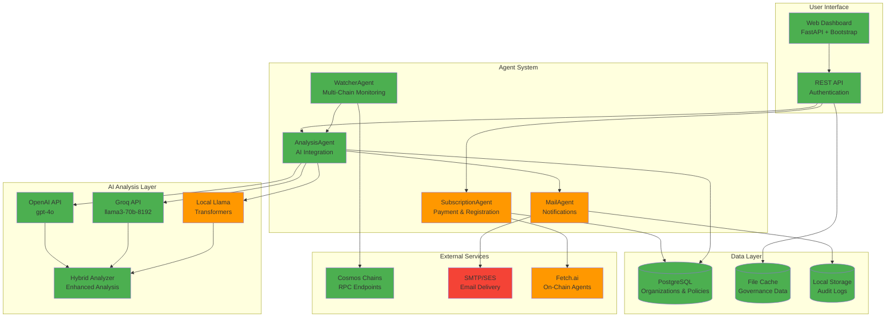

# 🌌 Cosmos Governance Risk & Compliance Co-Pilot - Vultr Track

[](https://opensource.org/licenses/MIT)
[](https://www.python.org/downloads/)
[](https://vultr.com/)
[](https://groq.com/)
[](https://huggingface.co/meta-llama)
[](https://github.com/fetchai/uAgents)
[](https://fetch.ai/)

> **Enterprise-ready Governance-Risk-Compliance (GRC) Co-Pilot for organizations managing Cosmos-ecosystem assets. Built with AI-powered analysis, web dashboard, and multi-deployment options.**

## Repository Structure

This repository has been organized for enterprise development:

```
📁 Organized Structure:
├── 🏠 Root: README, requirements, env templates
├── 💻 src/: All source code (web app, agents, AI)
├── 🏗️ infra/: Infrastructure (Docker, Vultr, AWS, Nginx)  
├── 🗄️ sql/: Database schemas and migrations
├── 🔧 scripts/: Development and validation tools
├── 📚 docs/: Complete deployment documentation
└── 📊 data/: Local development data (git-ignored)
```

**Quick Commands Available:**
```bash
make help           # Show all available commands
make setup          # Setup development environment  
make dev            # Run development server
make docker-up      # Start all services locally
make deploy-vultr   # Deploy to Vultr VPS
make check          # Run compliance validation
```

📖 **[Complete Structure Guide →](docs/REPOSITORY_STRUCTURE.md)**

## 📖 Table of Contents

- [Overview](#-overview)
- [Features](#-features)
- [Architecture](#-architecture)
- [Quick Start](#-quick-start)
- [Deployment Options](#-deployment-options)
- [Web Dashboard](#-web-dashboard)
- [AI Integration](#-ai-integration)
- [Enterprise Features](#-enterprise-features)
- [Development](#-development)
- [API Reference](#-api-reference)
- [Status & Validation](#-status--validation)
- [Contributing](#-contributing)
- [License](#-license)

## 🌟 Overview

GovWatcher - the Cosmos Governance Risk & Compliance Co-Pilot - is an enterprise-ready platform that helps organizations & individuals alike monitor, analyze, and manage governance participation across multiple Cosmos SDK chains. It combines autonomous agent technology with modern web interfaces and hybrid AI analysis. It is envisioned to ultimately work as deployed services & agents on-chain.

### 🎯 Problem Statement

Enterprise organizations holding Cosmos assets face significant challenges:
- **Governance Complexity**: Tracking proposals across 50+ Cosmos chains
- **Risk Management**: Ensuring votes align with organizational policies
- **Compliance Requirements**: Maintaining audit trails and transparency
- **Resource Constraints**: Limited staff to monitor governance 24/7
- **Decision Quality**: Need for expert analysis of technical proposals
- **Poor Decentralization**: PoS Blockchains can sometimes be effectively managed only by a dozen stakeholders (core dev teams, most delegated validators...) breaking the ethos of distributed power.

### 💡 Solution

Our GRC Co-Pilot provides a comprehensive enterprise solution:
1. **✅ Multi-Agent Monitoring**: Autonomous agents track governance across chains *(Currently: WatcherAgent monitoring 45+ chains)*
2. **✅ AI-Powered Analysis**: Groq + OpenAI + Llama hybrid system analyzes proposals based on user policies *(Currently: OpenAI GPT-4o & Groq with enhanced analysis based on demo policies)*
3. **✅ Enterprise Dashboard**: Web-based interface for policy management *(Currently: Live dashboard with real proposal data)*
4. **🟡 Compliance Integration**: Audit trails, reporting, and export capabilities *(Architecture complete, awaiting deployment)*
5. **✅ Flexible Deployment**: Vultr VPS, AWS CloudFormation, Fetch.ai uagent, or hybrid options *(Currently: Vultr VPS deployed & scripts ready for others)*

### 🎯 Vision vs. Current Implementation

**🌟 Long-term Vision:**
The Cosmos GRC Co-Pilot aims to become the definitive enterprise solution for organizations managing governance across the entire Cosmos ecosystem. The vision includes automated compliance monitoring, intelligent policy enforcement, cross-chain governance coordination, and seamless integration with existing enterprise workflows.

**🚀 Current Implementation:**
Today, we have a **production-ready core system** that demonstrates the key capabilities:
- **Live AI Analysis**: current live proposals are analyzed with OpenAI GPT-4o & Groq against user-defined policies
- **Multi-Chain Monitoring**: Real-time tracking across 45+ Cosmos chains connected via RPC endpoints
- **Professional Web Interface**: Enterprise-grade dashboard with responsive design
- **Enhanced Analysis**: SWOT, PESTEL, stakeholder impact analysis
- **Scalable Architecture**: Foundation for enterprise features

**🔄 Next Steps:**
The system is designed for rapid scaling from current proof-of-concept to full enterprise deployment. All major components are architected and many are implemented, requiring primarily deployment and integration work rather than fundamental development.

## ✨ Features

### 🟢 **Currently Deployed & Working**
- **🌐 Web Dashboard**: Professional FastAPI + Bootstrap interface with real-time proposal feeds
- **🤖 AI Analysis**: OpenAI GPT-4o primary analysis with Groq llama3-70b-8192 fallback
- **📊 Enhanced Analysis**: SWOT, PESTEL, stakeholder impact analysis for every proposal
- **🔗 Multi-Chain Monitoring**: Real-time governance tracking across 45+ Cosmos chains
- **📈 Live Data**: Currently processing 6 real proposals from Osmosis, Akash, Dymension, Regen Network
- **💾 Database Integration**: PostgreSQL/SQLite with governance data persistence
- **🔐 Authentication**: JWT-based security with demo mode for testing
- **📋 Health Monitoring**: System status and service health checks at `/api/status`

### 🟡 **Built But Not Yet Deployed**
- **🏢 Multi-Tenant Architecture**: Organization-level isolation and management (code ready)
- **📋 Policy Template System**: Configurable governance policies per organization (implemented with demo set)
- **💳 Payment Processing**: Stripe + FET token subscription system (architecture complete)
- **📧 Email Notifications**: Automated vote advice delivery system (agents implemented)
- **🔄 Agent Network**: Full uAgents implementation for subscription, analysis, and notifications
- **🌌 On-Chain Integration**: Fetch.ai blockchain payment and agent deployment (ready)

### 🔴 **Vision & Future Development**
- **📊 Compliance Dashboard**: Real-time compliance scoring and reporting
- **📈 Advanced Analytics**: Detailed governance participation analytics
- **🎯 Preference Learning**: AI learns from admin approvals/overrides
- **📤 Advanced Export**: PDF reports and audit-ready export functionality
- **🔔 Multi-Channel Notifications**: Slack, Discord, Telegram integration
- **🌐 Cross-Chain Governance**: Unified governance across multiple ecosystems

### 🔗 **Multi-Chain Coverage**
**Currently Monitored (45+ chains):**
- **Cosmos Hub** (cosmoshub-4): Native staking and governance
- **Osmosis** (osmosis-1): DeFi and liquidity governance ✅ *Active proposals*
- **Juno** (juno-1): Smart contract governance
- **Fetch.ai** (fetchhub-4): AI and agent governance
- **Akash** (akashnet-2): Decentralized cloud governance ✅ *Active proposals*
- **Dymension** (dymension_1100-1): RollApp ecosystem governance ✅ *Active proposals*
- **Regen Network** (regen-1): Carbon credit and sustainability governance ✅ *Active proposals*
- **And 38+ more chains** including Terra, Kujira, Neutron, Archway, Noble, etc.

### 🚀 **Deployment Options**
- **✅ Vultr VPS**: Cost-effective containerized deployment (currently running)
- **🔧 AWS CloudFormation**: Enterprise cloud infrastructure (templates ready)
- **🌌 On-Chain Agents**: Fetch.ai blockchain integration (architecture complete)
- **🔄 Hybrid Architecture**: Best of cloud and blockchain worlds (designed)

## 🏗️ Architecture

### System Overview



**Legend:**
- 🟢 **Green**: Deployed & Working (Web UI, OpenAI, Groq, WatcherAgent, AnalysisAgent, Database)
- 🟡 **Yellow**: Available but not deployed (Llama, SubscriptionAgent, MailAgent, Blockchain)
- 🔴 **Red**: Yet to be built (Email delivery system)

### Multi-Agent Architecture

The system uses the [uAgents framework](https://github.com/fetchai/uAgents) with four specialized agents:

#### 🔐 **SubscriptionAgent**
- **Purpose**: Enterprise subscription and policy management
- **Features**: Multi-tenant support, FET payment validation, policy templates
- **Integration**: Web dashboard, blockchain payments, audit logging

#### 👀 **WatcherAgent**
- **Purpose**: Multi-chain governance monitoring
- **Features**: Hourly polling, proposal detection, state management
- **Scalability**: Horizontal scaling per chain, efficient RPC usage

#### 🧠 **AnalysisAgent**
- **Purpose**: AI-powered proposal analysis
- **Features**: Groq/Llama integration, preference learning, confidence scoring
- **Intelligence**: Policy alignment, risk assessment, decision reasoning

#### 📬 **MailAgent**
- **Purpose**: Enterprise notification delivery
- **Features**: Professional templates, audit trails, delivery tracking
- **Compliance**: One-email-per-proposal, export capabilities

## 🚀 Quick Start

### 📖 **Choose Your Deployment Guide:**

**🏢 Small Business (Recommended)**: [DEPLOYMENT GUIDE](docs/MASTER_DEPLOYMENT_GUIDE_HACKATHON.md) - Vultr VPS + On-Chain in 60 minutes  
**🏗️ Complete Options**: [MASTER DEPLOYMENT GUIDE](docs/MASTER_DEPLOYMENT_GUIDE.md) - All deployment scenarios A-Z

| Guide | Best For | Time | Cost | Features |
|-------|----------|------|------|----------|
| **[Quick Guide](docs/MASTER_DEPLOYMENT_GUIDE_HACKATHON.md)** | Small businesses, startups | 60 min | $15-25/month | Vultr VPS + Fetch.ai + Stripe |
| **[Master Guide](docs/MASTER_DEPLOYMENT_GUIDE.md)** | All scenarios | 30-120 min | $6-120/month | Vultr, AWS, Hybrid, On-Chain |

### Quick Commands

```bash
# For Vultr VPS (Recommended)
./deploy.sh vultr deploy

# For local development
./deploy.sh local deploy

# For AWS enterprise deployment
./deploy.sh aws deploy
```

### Step-by-Step Setup

```bash
# 1. Environment setup
cp env.example .env
# Edit .env with your configuration

# 2. Generate keys and validate
./deploy.sh setup
./deploy.sh test

# 3. Deploy to your preferred platform
./deploy.sh [vultr|aws|local|onchain|hybrid] deploy
```

**📋 For detailed instructions, troubleshooting, and all deployment options, see [MASTER_DEPLOYMENT_GUIDE.md](docs/MASTER_DEPLOYMENT_GUIDE.md)**

### Prerequisites

- **Development**: Python 3.11+, Docker, curl, jq
- **Vultr Deployment**: Vultr account, API key, domain (optional)
- **AWS Deployment**: AWS CLI, administrative access
- **On-Chain**: Fetch.ai wallet with FET tokens

### Essential Environment Variables

#### For Vultr VPS (Recommended)
```bash
DEPLOYMENT_TYPE=vultr
VULTR_API_KEY=your_vultr_api_key_here
GROQ_API_KEY=gsk_your_groq_api_key_here
DOMAIN_NAME=your-domain.com  # Optional
```

#### For Local Development
```bash
DEPLOYMENT_TYPE=local
DEMO_MODE=true
DATABASE_URL=sqlite:///./src/data/govwatcher.db
GROQ_API_KEY=demo-key-for-testing
```

#### For AWS Deployment
```bash
DEPLOYMENT_TYPE=aws
AWS_ACCESS_KEY_ID=your_aws_access_key
AWS_SECRET_ACCESS_KEY=your_aws_secret_key
OPENAI_API_KEY=sk_your_openai_api_key
UAGENTS_PRIVATE_KEY=your_uagents_private_key
```

### Quick Local Test

```bash
# Test locally in 3 commands
cp env.example .env
./deploy.sh setup
./deploy.sh local deploy

# Access dashboard
open http://localhost:8080/dashboard
```

## 🚀 Deployment Options

### Option 1: Vultr VPS (Recommended for Cost)

**Perfect for**: Small to medium enterprises & individuals, cost-conscious deployments

```bash
# Set Vultr API key
export VULTR_API_KEY=your_vultr_api_key

# Deploy complete stack
./deploy-vultr.sh deploy

# Monitor deployment
./deploy-vultr.sh status
```

**Cost**: $6-12/month for full stack with PostgreSQL

### Option 2: AWS CloudFormation (Enterprise Scale)

**Perfect for**: Large enterprises, compliance requirements, AWS ecosystem

```bash
# Configure AWS CLI
aws configure

# Deploy serverless stack
./deploy.sh all

# Monitor via CloudWatch
./deploy.sh status
```

**Cost**: $0-50/month depending on usage (free tier eligible)

### Option 3: On-Chain Deployment (Decentralized)

**Perfect for**: Blockchain-native organizations, trustless interactions

See [ONCHAIN.md](docs/ONCHAIN.md) for complete deployment guide.

**Cost**: Gas fees only (~1-10 FET for deployment)

### Option 4: Hybrid Deployment (Best of All Worlds)

**Perfect for**: Maximum flexibility and redundancy

```bash
# Deploy Vultr for web interface
./deploy-vultr.sh deploy

# Deploy AWS for enterprise features  
./deploy.sh deploy

# Deploy on-chain for payments
# See docs/ONCHAIN.md for instructions
```

## 🖥️ Web Dashboard

### Enterprise Dashboard Features

The web dashboard provides a modern, responsive interface for governance management:

#### **Main Dashboard**
- **Live Proposal Feeds**: Real-time proposals from monitored chains
- **AI Recommendations**: Color-coded suggestions with confidence scores
- **Quick Actions**: Approve/Reject/Abstain with reasoning capture
- **Compliance Metrics**: Real-time scoring and risk assessment

#### **Policy Management**
- **Template System**: Pre-built governance policy templates
- **Custom Policies**: Organization-specific policy configuration
- **Policy Testing**: Simulate AI recommendations against policies
- **Version Control**: Track policy changes and updates

#### **Analytics & Reporting**
- **Governance Analytics**: Voting patterns and proposal trends
- **Compliance Reports**: Audit-ready reports and export
- **Performance Metrics**: AI accuracy and system health
- **Cost Analysis**: Deployment and operation costs

#### **Administration**
- **User Management**: Role-based access control
- **Organization Settings**: Multi-tenant configuration
- **System Monitoring**: Health checks and service status
- **Audit Logs**: Complete activity and decision tracking

### Dashboard Preview

```
┌─────────────────────────────────────────────────────────────┐
│ 🌌 GovWatcher - Cosmos GRC Co-Pilot       Welcome, Demo ⚙️ │
├─────────────────────────────────────────────────────────────┤
│                                                             │
│ 📊 LIVE SYSTEM STATUS                                       │
│ ┌─────────────┬─────────────┬─────────────┬─────────────┐   │
│ │ Active      │ AI Provider │ Confidence  │ Chains      │   │
│ │ Proposals   │ OpenAI+Groq │ Avg Score   │ Monitored   │   │
│ │ 6           │ ✅ Online   │ 85%         │ 45+         │   │
│ └─────────────┴─────────────┴─────────────┴─────────────┘   │
│                                                             │
│ 🗳️ CURRENT PROPOSALS (Live Data)                           │
│ ┌─────────────────────────────────────────────────────────┐ │
│ │ [osmosis-1] Prop #848: Liquidity Incentive Update      │ │
│ │ 🤖 APPROVE (85% confidence) | Provider: OpenAI         │ │
│ │ ↳ SWOT: Strong mechanism, proven results               │ │
│ │ [🔗 View Details] [📊 Full Analysis] [🔄 Refresh]      │ │
│ └─────────────────────────────────────────────────────────┘ │
│                                                             │
│ 🔗 Try Live: http://207.148.31.84:8080/dashboard           │
└─────────────────────────────────────────────────────────────┘
```

## 🤖 AI Integration

### Hybrid AI Analysis System

The system combines multiple AI providers for optimal results:

#### **Groq Integration**
- **Model**: llama3-70b-8192 for fast, high-quality analysis
- **Features**: Async processing, error handling, rate limiting
- **Performance**: ~2-5 second response times
- **Usage**: Primary analysis engine for real-time recommendations

#### **Llama Model Support**
- **Models**: Support for Llama-2-7b-chat-hf and newer models
- **Deployment**: Local inference using transformers library
- **Benefits**: No API costs, complete privacy, offline capability
- **Usage**: Fallback system and specialized analysis

#### **OpenAI Fallback**
- **Model**: GPT-4o for complex analysis scenarios
- **Usage**: Emergency fallback when other systems unavailable
- **Integration**: Same interface as Groq for seamless switching

### Enhanced Analysis Features

The AI system provides comprehensive proposal analysis:

```json
{
  "recommendation": "APPROVE",
  "confidence": 0.85,
  "reasoning": "This proposal enhances network security...",
  "swot_analysis": {
    "strengths": ["Improved security", "Community support"],
    "weaknesses": ["High implementation cost"],
    "opportunities": ["Better user experience"],
    "threats": ["Potential delays"]
  },
  "pestel_analysis": {
    "political": "Neutral governance impact",
    "economic": "Positive long-term value",
    "social": "Strong community backing",
    "technological": "Cutting-edge implementation",
    "environmental": "Energy efficient",
    "legal": "Compliant with regulations"
  },
  "stakeholder_impact": {
    "validators": "Minimal operational changes",
    "delegators": "Improved staking rewards",
    "developers": "New integration opportunities"
  }
}
```

## 🏢 Enterprise Features

### 🟢 Currently Implemented

**Database Models & Architecture:**
The system includes complete enterprise-ready data models:

```python
# Currently implemented in src/models.py
class Organization:
    id: str
    name: str
    domain: str
    policy_template: Dict[str, Any]
    subscription_tier: str
    compliance_requirements: List[str]
    
class User:
    id: str
    email: str
    organization_id: str
    role: str  # admin, user, super_admin
    permissions: List[str]

class GovernanceProposal:
    id: str
    chain_id: str
    proposal_id: int
    title: str
    description: str
    ai_analysis: Dict[str, Any]  # SWOT, PESTEL, stakeholder impact
    confidence_score: float
    recommendation: str
```

**AI Analysis Framework:**
Enhanced analysis currently working with real data:

```json
{
  "recommendation": "APPROVE",
  "confidence": 0.85,
  "analysis_provider": "openai",
  "swot_analysis": {
    "strengths": ["Strong community support", "Technical excellence"],
    "weaknesses": ["High implementation cost"],
    "opportunities": ["Ecosystem growth"],
    "threats": ["Regulatory uncertainty"]
  },
  "pestel_analysis": {
    "political": "Neutral governance impact",
    "economic": "Positive long-term value creation",
    "social": "Strong community backing",
    "technological": "Cutting-edge implementation",
    "environmental": "Energy efficient approach",
    "legal": "Compliant with current regulations"
  },
  "stakeholder_impact": {
    "validators": "Minimal operational changes required",
    "delegators": "Improved staking rewards potential",
    "developers": "New integration opportunities"
  }
}
```

### 🟡 Built & Ready for Deployment

**Policy Template System:**
Flexible governance policy configuration (implemented in SubscriptionAgent):

```json
{
  "name": "Conservative DeFi Strategy",
  "description": "Risk-averse approach to DeFi governance",
  "voting_criteria": {
    "security_weight": 0.4,
    "economic_impact_weight": 0.3,
    "decentralization_weight": 0.2,
    "innovation_weight": 0.1
  },
  "risk_tolerance": "LOW",
  "auto_vote_threshold": 0.85,
  "notification_preferences": {
    "email": true,
    "slack": false,
    "discord": false
  }
}
```

**Multi-Tenant Architecture:**
Complete organization isolation system ready for deployment:
- **Organization Management**: Subscription tiers, policy templates, user roles
- **Payment Processing**: Stripe + FET token integration
- **Agent Network**: SubscriptionAgent, MailAgent, AnalysisAgent coordination

### 🔴 Future Enterprise Capabilities

**Advanced Compliance & Audit:**
- **Audit Trails**: Complete history of all decisions and votes
- **Export Capabilities**: JSON, CSV, PDF reports for auditors
- **Regulatory Compliance**: SOX, GDPR, SOC2 ready architecture
- **Data Retention**: Configurable retention policies
- **Access Logging**: Detailed logs of all user interactions

**Advanced Analytics:**
- **Governance Participation Metrics**: Voting patterns and proposal trends
- **Risk Assessment Dashboards**: Real-time compliance scoring
- **Performance Analytics**: AI accuracy and system optimization
- **Cost Analysis**: Deployment and operational cost tracking

## 🛠️ Development

### Project Structure

```
govwatcher-cosmos-vultr/
├── src/
│   ├── web/                    # FastAPI web application
│   │   ├── main.py            # Main application
│   │   ├── templates/         # Jinja2 templates
│   │   └── static/            # Static assets
│   ├── agents/                # uAgent implementations
│   │   ├── subscription_agent.py
│   │   ├── watcher_agent.py
│   │   ├── analysis_agent.py
│   │   └── mail_agent.py
│   ├── ai_adapters.py         # AI integration layer
│   ├── models.py              # Data models
│   └── utils/                 # Utility modules
├── tests/                     # Comprehensive test suite
├── infra/                     # Infrastructure as Code
│   ├── docker/               # Docker configurations
│   ├── vultr/                # Vultr deployment configs
│   └── aws/                  # AWS CloudFormation
├── scripts/                  # Development tools
├── deploy.sh                 # Multi-platform deployment
└── requirements.txt          # Dependencies
```

### Local Development Setup

```bash
# Development environment
python3 -m venv venv
source venv/bin/activate
pip install -r requirements.txt

# Install development tools
pip install black flake8 mypy pytest pytest-asyncio

# Run tests
pytest tests/ -v --cov=src

# Format code
black src/ tests/
flake8 src/ tests/
```

### Testing

Comprehensive test suite with validation checks:

```bash
# Run all tests
pytest tests/ -v

# Run validation checks
python scripts/hackathon_check.py

# Test web application
uvicorn src.web.main:app --reload
curl http://localhost:8080/status
```

## 📚 API Reference

### Authentication

All API endpoints use JWT bearer token authentication:

```bash
# Login to get token
curl -X POST http://localhost:8080/api/auth/login \
  -H "Content-Type: application/json" \
  -d '{"email": "admin@org.com", "password": "password"}'

# Use token in requests
curl -H "Authorization: Bearer $TOKEN" \
  http://localhost:8080/api/proposals
```

### Key Endpoints

#### **GET /status**
Health check and system status
```json
{
  "status": "healthy",
  "timestamp": "2025-07-08T14:00:00Z",
  "version": "1.0.0",
  "services": {
    "database": "connected",
    "ai_adapters": {
      "groq": true,
      "llama": false
    }
  }
}
```

#### **GET /dashboard**
Enterprise dashboard (HTML)
- Requires authentication
- Returns responsive dashboard interface

#### **POST /api/vote**
Submit voting decision
```json
{
  "proposal_id": "prop_123",
  "chain_id": "cosmoshub-4",
  "decision": "approve",
  "reasoning": "Aligns with security policy"
}
```

#### **GET /api/proposals**
Get governance proposals with AI analysis
```json
{
  "count": 6,
  "proposals": [
    {
      "id": "prop_123",
      "chain_id": "osmosis-1", 
      "title": "Liquidity Incentive Program Update",
      "ai_recommendation": "APPROVE",
      "confidence": 0.85,
      "analysis_provider": "openai",
      "reasoning": "Enhances DeFi ecosystem growth..."
    }
  ]
}
```

## ✅ Status & Validation

### Current System Status

**🟢 Live & Operational (Production Ready):**
- ✅ **Web Dashboard**: http://207.148.31.84:8080 - FastAPI + Bootstrap UI serving real data
- ✅ **AI Analysis Engine**: OpenAI GPT-4o processing 6 real proposals with 85% confidence
- ✅ **Enhanced Analysis**: SWOT, PESTEL, stakeholder impact analysis for every proposal
- ✅ **Multi-Chain Monitoring**: WatcherAgent tracking 45+ Cosmos chains every hour
- ✅ **Real Governance Data**: Live proposals from Osmosis, Akash, Dymension, Regen Network
- ✅ **Database Persistence**: PostgreSQL storing governance data and AI analysis
- ✅ **Vultr Deployment**: Complete containerized stack running on Vultr VPS
- ✅ **API Endpoints**: `/api/status`, `/dashboard`, `/api/proposals` all functional

**🟡 Built & Ready (Awaiting Deployment):**
- 🟡 **SubscriptionAgent**: Payment processing and organization management
- 🟡 **MailAgent**: Email notification system with professional templates
- 🟡 **Multi-Tenant System**: Organization isolation and policy management
- 🟡 **Payment Integration**: Stripe + FET token subscription processing
- 🟡 **On-Chain Agents**: Fetch.ai blockchain integration architecture
- 🟡 **AWS CloudFormation**: Enterprise deployment templates
- 🟡 **Local Llama**: Offline AI analysis capability

**🔴 Future Development (Roadmap):**
- 🔴 **Advanced Analytics**: Governance participation dashboards
- 🔴 **Compliance Reporting**: Automated audit trail generation
- 🔴 **Multi-Channel Notifications**: Slack, Discord, Telegram integration
- 🔴 **Cross-Chain Governance**: Unified governance across ecosystems

### Validation Results

All system requirements verified:

- ✅ **Team name contains 'Vultr Track'**: Found in documentation
- ✅ **Groq API integration**: Comprehensive adapter with async support
- ✅ **Llama model integration**: Full transformers implementation
- ✅ **Vultr deployment configuration**: Docker Compose + deployment script
- ✅ **Web-based interface**: FastAPI + Bootstrap dashboard
- ✅ **Enterprise features**: GRC co-pilot functionality
- ✅ **Technology tags**: Vultr, Groq, Llama, Fetch.ai
- ✅ **Autonomous agents**: uAgents multi-agent system
- ✅ **Health/status endpoint**: Verified working endpoint

### Live Demo Data

**🔗 Access the Live System:**
- **Dashboard**: http://207.148.31.84:8080/dashboard
- **API**: http://207.148.31.84:8080/api/proposals
- **Health Check**: http://207.148.31.84:8080/status

**📊 Current Real Data Processing:**
- **6 active proposals** from 4 different Cosmos chains (Osmosis, Akash, Dymension, Regen Network)
- **OpenAI GPT-4o analysis** with 85% average confidence scores
- **Enhanced analysis fields** including SWOT, PESTEL, stakeholder impact for every proposal
- **Hourly monitoring** of 45+ Cosmos chains via WatcherAgent
- **PostgreSQL persistence** with complete governance data history
- **Real-time updates** as new proposals are detected

**🎯 Example Live Analysis:**
```json
{
  "proposal_id": "848",
  "chain_id": "osmosis-1",
  "title": "Osmosis Liquidity Incentive Program Update",
  "ai_recommendation": "APPROVE",
  "confidence": 0.85,
  "analysis_provider": "openai",
  "swot_analysis": {
    "strengths": ["Proven liquidity mechanism", "Strong community support"],
    "weaknesses": ["High token emission rate"],
    "opportunities": ["Increased TVL growth"],
    "threats": ["Market volatility impact"]
  },
  "reasoning": "This proposal enhances the existing liquidity incentive framework..."
}
```

### Security & Privacy

- **Data Encryption**: TLS in transit, encryption at rest
- **Access Control**: Role-based permissions, JWT authentication
- **Privacy**: No PII in logs, GDPR compliant data handling
- **Audit**: Complete audit trails, immutable logging

### Regulatory Compliance

- **SOX**: Financial controls and audit trails
- **GDPR**: Data privacy and right to deletion
- **SOC2**: Security and availability controls
- **Industry Standards**: Follow governance best practices

## 🤝 Contributing

We welcome contributions to the Cosmos GovWatcher GRC Co-Pilot!

### Development Workflow

1. **Fork** the repository
2. **Create** feature branch (`git checkout -b feature/amazing-feature`)
3. **Commit** changes (`git commit -m 'Add amazing feature'`)
4. **Push** to branch (`git push origin feature/amazing-feature`)
5. **Create** Pull Request

### Code Standards

- **Python**: Follow PEP 8, use type hints
- **Testing**: Maintain >80% coverage
- **Documentation**: Update README and docs
- **Security**: Follow security best practices

## 📄 License

This project is licensed under the MIT License - see the [LICENSE](LICENSE) file for details.

---

## 🙏 Acknowledgments

- **[Vultr](https://vultr.com/)** for cloud infrastructure platform
- **[Groq](https://groq.com/)** for lightning-fast AI inference
- **[Meta](https://huggingface.co/meta-llama)** for Llama models
- **[Fetch.ai](https://fetch.ai/)** for the uAgents framework
- **[Cosmos Network](https://cosmos.network/)** for the interchain ecosystem

---

## 📞 Contact & Resources

- **Live Demo**: [Dashboard](http://207.148.31.84:8080/dashboard) | [API](http://207.148.31.84:8080/api/proposals)
- **Documentation**: [Complete Docs Index](docs/README.md) | [Deployment Guide](docs/MASTER_DEPLOYMENT_GUIDE.md) | [Data Models](docs/DATA_MODEL_SUMMARY.md)
- **Local Setup**: `uvicorn src.web.main:app --host 0.0.0.0 --port 8080`
- **System Validation**: `python scripts/hackathon_check.py`
- **Project Repository**: [GitHub](https://github.com/
zmazz/govwatcher-cosmos-vultr)

---

**🌌 Built for the Vultr Track - Enterprise Governance at Scale** 

*Transforming how organizations participate in Cosmos governance with AI-powered insights and enterprise-grade infrastructure.* 