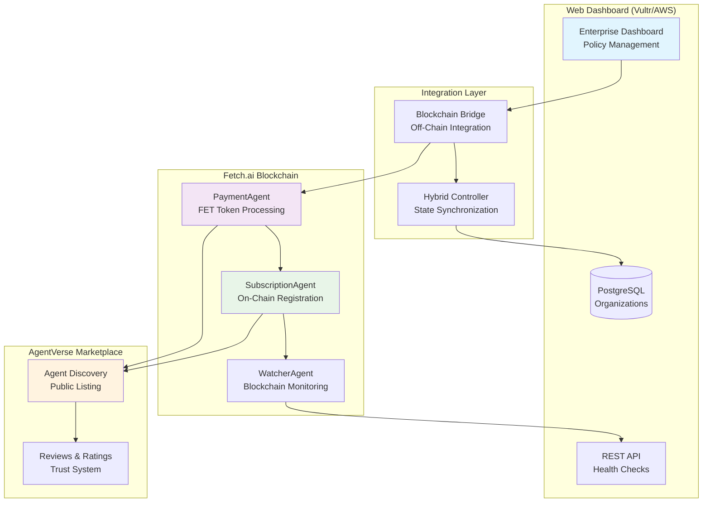

# 🌐 On-Chain Deployment Guide - Cosmos GRC Co-Pilot

This guide covers deploying your Cosmos Governance Risk & Compliance Co-Pilot agents to the Fetch.ai blockchain and AgentVerse platform, creating a fully decentralized governance solution that integrates with your Vultr/AWS infrastructure.

## 📋 Prerequisites

### Required Infrastructure
- ✅ **Vultr/AWS Deployment** completed (see [MASTER_DEPLOYMENT_GUIDE.md](MASTER_DEPLOYMENT_GUIDE.md))
- ✅ **Web dashboard** operational at your deployment URL
- ✅ **AI adapters** (Groq/Llama) configured and tested
- ✅ **Health endpoints** responding (`/status` endpoint accessible)

### Required Accounts & Tools
- [ ] **Fetch.ai Wallet** with sufficient FET tokens (minimum 500 FET recommended)
- [ ] **AgentVerse Account** (https://agentverse.ai)
- [ ] **uAgents CLI** installed and configured
- [ ] **Groq API Key** (already configured in your deployment)
- [ ] **Domain Name** (optional, for professional presentation)

### FET Token Requirements
- **Agent Deployment**: ~50 FET per agent (5 agents = 250 FET)
- **Agent Registration**: ~10 FET per agent for AgentVerse
- **Operational Costs**: ~1-5 FET per month per agent
- **Buffer**: 200 FET recommended for testing and operations

## 🎯 Overview

The on-chain deployment creates a fully decentralized governance system that:
- **Accepts payments** directly in FET tokens on Fetch.ai blockchain
- **Provides trustless subscriptions** without centralized payment processing
- **Enables marketplace discovery** through AgentVerse
- **Integrates seamlessly** with your existing web dashboard
- **Offers hybrid architecture** combining blockchain and traditional cloud benefits

## 🏗️ On-Chain Architecture

### System Integration



## 🚀 Step 1: Prepare On-Chain Environment

### 1.1 Set Up Fetch.ai Wallet

```bash
# Install fetchd CLI
curl -L https://github.com/fetchai/fetchd/releases/latest/download/fetchd-linux-amd64 -o fetchd
chmod +x fetchd
sudo mv fetchd /usr/local/bin/

# Create wallet
fetchd keys add govwatcher-deployer

# Fund wallet with FET tokens
# Send at least 500 FET to the generated address
fetchd query bank balances $(fetchd keys show govwatcher-deployer -a)
```

### 1.2 Generate Agent Identities

```bash
# Navigate to your project directory
cd /path/to/uagents-govwatcher

# Generate unique addresses for each agent
uagents generate-key --name payment-agent
uagents generate-key --name subscription-agent
uagents generate-key --name watcher-agent-cosmoshub
uagents generate-key --name watcher-agent-osmosis
uagents generate-key --name integration-agent

# Save the generated addresses and private keys
# You'll need these for configuration
```

### 1.3 Create On-Chain Configuration

Create `onchain-config.json`:

```json
{
  "network": "fetchai-mainnet",
  "deployer_wallet": "fetch1your_deployer_address_here",
  "agents": {
    "payment": {
      "name": "Cosmos GRC Payment Agent",
      "description": "Handles FET token payments for governance subscriptions",
      "address": "agent1payment_address_here",
      "private_key": "payment_private_key_here",
      "port": 8001,
      "endpoints": ["http://your-vultr-ip:8001/submit"]
    },
    "subscription": {
      "name": "Enterprise Subscription Agent",
      "description": "Manages enterprise governance subscriptions",
      "address": "agent1subscription_address_here",
      "private_key": "subscription_private_key_here",
      "port": 8002,
      "endpoints": ["http://your-vultr-ip:8002/submit"]
    },
    "watcher_cosmoshub": {
      "name": "Cosmos Hub Governance Watcher",
      "description": "Monitors Cosmos Hub governance proposals",
      "address": "agent1watcher_cosmoshub_address_here", 
      "private_key": "watcher_cosmoshub_private_key_here",
      "port": 8003,
      "chain_id": "cosmoshub-4"
    },
    "watcher_osmosis": {
      "name": "Osmosis Governance Watcher", 
      "description": "Monitors Osmosis governance proposals",
      "address": "agent1watcher_osmosis_address_here",
      "private_key": "watcher_osmosis_private_key_here", 
      "port": 8004,
      "chain_id": "osmosis-1"
    },
    "integration": {
      "name": "Dashboard Integration Agent",
      "description": "Bridges blockchain and web dashboard",
      "address": "agent1integration_address_here",
      "private_key": "integration_private_key_here",
      "port": 8005,
      "endpoints": ["http://your-vultr-ip:8005/submit"]
    }
  },
  "pricing": {
    "annual_subscription_fet": 25,
    "additional_chain_fet": 5,
    "enterprise_tier_fet": 100,
    "payment_timeout_seconds": 600
  },
  "integration": {
    "dashboard_url": "https://your-vultr-ip/dashboard",
    "api_base_url": "https://your-vultr-ip/api",
    "health_check_url": "https://your-vultr-ip/status"
  }
}
```

## 🔗 Step 2: Create On-Chain Agent Scripts

### 2.1 Payment Agent (FET Token Processing)

Create `src/onchain/payment_agent.py`:

```python
"""
On-Chain Payment Agent for Cosmos GRC Co-Pilot
Handles FET token payments and subscription validation
"""

import asyncio
import json
from typing import Dict, Any, Optional
from uagents import Agent, Context, Model
from uagents.network import wait_for_tx_to_complete
from uagents.crypto import Identity
import requests
import os
from decimal import Decimal

# Load configuration
with open('onchain-config.json', 'r') as f:
    config = json.load(f)

# Initialize payment agent
payment_agent = Agent(
    name=config['agents']['payment']['name'],
    seed=config['agents']['payment']['private_key'],
    port=config['agents']['payment']['port'],
    endpoint=config['agents']['payment']['endpoints']
)

class PaymentRequest(Model):
    """Request for payment processing"""
    organization_name: str
    contact_email: str
    subscription_tier: str  # basic, enterprise
    chains: list[str]
    payment_amount: float
    payment_tx_hash: str
    metadata: Dict[str, Any] = {}

class PaymentResponse(Model):
    """Response from payment processing"""
    success: bool
    message: str
    subscription_id: str = ""
    payment_verified: bool = False
    expires_at: str = ""
    dashboard_url: str = ""
    agent_addresses: Dict[str, str] = {}

@payment_agent.on_message(model=PaymentRequest, replies=PaymentResponse)
async def handle_payment(ctx: Context, sender: str, msg: PaymentRequest):
    """Handle FET token payment and subscription creation"""
    
    try:
        # Calculate expected payment amount
        base_fee = config['pricing']['annual_subscription_fet']
        if msg.subscription_tier == "enterprise":
            base_fee = config['pricing']['enterprise_tier_fet']
        
        additional_chains = max(0, len(msg.chains) - 1)
        total_fee = base_fee + (additional_chains * config['pricing']['additional_chain_fet'])
        
        # Verify payment amount
        if msg.payment_amount < total_fee:
            await ctx.send(sender, PaymentResponse(
                success=False,
                message=f"Insufficient payment. Expected {total_fee} FET, received {msg.payment_amount} FET"
            ))
            return
        
        # Verify payment on blockchain
        payment_valid = await verify_fet_payment(
            tx_hash=msg.payment_tx_hash,
            expected_amount=total_fee,
            recipient_address=payment_agent.address
        )
        
        if not payment_valid:
            await ctx.send(sender, PaymentResponse(
                success=False,
                message="Payment verification failed. Transaction not found or invalid.",
                payment_verified=False
            ))
            return
        
        # Create subscription in web dashboard
        subscription_data = {
            "organization_name": msg.organization_name,
            "contact_email": msg.contact_email,
            "chains": msg.chains, 
            "subscription_tier": msg.subscription_tier,
            "payment_verified": True,
            "payment_amount": total_fee,
            "payment_tx_hash": msg.payment_tx_hash,
            "sender_address": sender,
            "metadata": msg.metadata
        }
        
        dashboard_response = await create_dashboard_subscription(subscription_data)
        
        if dashboard_response.get('success'):
            # Return success with agent addresses
            agent_addresses = {
                "payment": payment_agent.address,
                "subscription": config['agents']['subscription']['address'],
                "watcher_cosmoshub": config['agents']['watcher_cosmoshub']['address'],
                "watcher_osmosis": config['agents']['watcher_osmosis']['address'], 
                "integration": config['agents']['integration']['address']
            }
            
            await ctx.send(sender, PaymentResponse(
                success=True,
                message="Subscription activated successfully! Check your email for dashboard access.",
                subscription_id=dashboard_response.get('subscription_id', ''),
                payment_verified=True,
                expires_at=dashboard_response.get('expires_at', ''),
                dashboard_url=config['integration']['dashboard_url'],
                agent_addresses=agent_addresses
            ))
        else:
            await ctx.send(sender, PaymentResponse(
                success=False,
                message="Payment verified but subscription creation failed. Please contact support.",
                payment_verified=True
            ))
            
    except Exception as e:
        ctx.logger.error(f"Payment processing error: {e}")
        await ctx.send(sender, PaymentResponse(
            success=False,
            message="Internal error processing payment. Please try again."
        ))

async def verify_fet_payment(tx_hash: str, expected_amount: float, recipient_address: str) -> bool:
    """Verify FET payment transaction on Fetch.ai blockchain"""
    try:
        # Query Fetch.ai blockchain for transaction details
        rpc_url = "https://rpc-fetchhub.fetch.ai"
        
        # Get transaction details
        response = requests.get(f"{rpc_url}/tx?hash={tx_hash}")
        if response.status_code != 200:
            return False
            
        tx_data = response.json()
        
        # Verify transaction details
        if not tx_data.get('result', {}).get('tx_result', {}).get('code') == 0:
            return False  # Transaction failed
            
        # Check transaction events for transfer
        events = tx_data.get('result', {}).get('tx_result', {}).get('events', [])
        
        for event in events:
            if event.get('type') == 'transfer':
                attributes = {attr['key']: attr['value'] for attr in event.get('attributes', [])}
                
                # Check recipient and amount
                if (attributes.get('recipient') == recipient_address and
                    float(attributes.get('amount', '0').replace('afet', '')) >= expected_amount * 1e18):
                    return True
        
        return False
        
    except Exception as e:
        print(f"Payment verification error: {e}")
        return False

async def create_dashboard_subscription(subscription_data: Dict[str, Any]) -> Dict[str, Any]:
    """Create subscription in the web dashboard"""
    try:
        # Call dashboard API to create subscription
        dashboard_url = config['integration']['api_base_url']
        
        response = requests.post(
            f"{dashboard_url}/subscriptions/blockchain",
            json=subscription_data,
            headers={'Content-Type': 'application/json'},
            timeout=30
        )
        
        if response.status_code == 200:
            return response.json()
        else:
            return {"success": False, "error": f"Dashboard API error: {response.status_code}"}
            
    except Exception as e:
        return {"success": False, "error": f"Dashboard communication error: {e}"}

@payment_agent.on_event("startup")
async def startup_event(ctx: Context):
    ctx.logger.info(f"Payment Agent started")
    ctx.logger.info(f"Agent address: {payment_agent.address}")
    ctx.logger.info(f"Accepting FET payments for GRC subscriptions")
    
    # Test dashboard connectivity
    health_url = config['integration']['health_check_url']
    try:
        response = requests.get(health_url, timeout=10)
        if response.status_code == 200:
            ctx.logger.info("Dashboard connectivity verified")
        else:
            ctx.logger.warning("Dashboard health check failed")
    except Exception as e:
        ctx.logger.error(f"Dashboard connectivity test failed: {e}")

if __name__ == "__main__":
    payment_agent.run()
```

### 2.2 Integration Agent (Dashboard Bridge)

Create `src/onchain/integration_agent.py`:

```python
"""
Integration Agent for Cosmos GRC Co-Pilot
Bridges blockchain agents with web dashboard
"""

import asyncio
import json
from typing import Dict, Any, List
from uagents import Agent, Context, Model
import requests
from datetime import datetime

# Load configuration
with open('onchain-config.json', 'r') as f:
    config = json.load(f)

# Initialize integration agent
integration_agent = Agent(
    name=config['agents']['integration']['name'],
    seed=config['agents']['integration']['private_key'],
    port=config['agents']['integration']['port'],
    endpoint=config['agents']['integration']['endpoints']
)

class ProposalAnalysisRequest(Model):
    """Request for proposal analysis"""
    chain_id: str
    proposal_id: int
    subscription_id: str
    organization_preferences: Dict[str, Any]

class ProposalAnalysisResponse(Model):
    """Response from proposal analysis"""
    success: bool
    analysis: Dict[str, Any] = {}
    recommendation: str = ""
    confidence: float = 0.0
    reasoning: str = ""

class DashboardUpdate(Model):
    """Update dashboard with blockchain data"""
    subscription_id: str
    update_type: str  # payment, proposal, analysis
    data: Dict[str, Any]

@integration_agent.on_message(model=ProposalAnalysisRequest, replies=ProposalAnalysisResponse)
async def handle_analysis_request(ctx: Context, sender: str, msg: ProposalAnalysisRequest):
    """Handle proposal analysis requests from blockchain"""
    
    try:
        # Get proposal data from dashboard
        proposal_data = await get_proposal_from_dashboard(msg.chain_id, msg.proposal_id)
        
        if not proposal_data:
            await ctx.send(sender, ProposalAnalysisResponse(
                success=False,
                reasoning="Proposal not found in dashboard"
            ))
            return
        
        # Request AI analysis from dashboard
        analysis_request = {
            "chain_id": msg.chain_id,
            "proposal_id": msg.proposal_id,
            "title": proposal_data.get('title', ''),
            "description": proposal_data.get('description', ''),
            "organization_preferences": msg.organization_preferences
        }
        
        analysis_result = await request_ai_analysis(analysis_request)
        
        if analysis_result.get('success'):
            await ctx.send(sender, ProposalAnalysisResponse(
                success=True,
                analysis=analysis_result.get('analysis', {}),
                recommendation=analysis_result.get('recommendation', ''),
                confidence=analysis_result.get('confidence', 0.0),
                reasoning=analysis_result.get('reasoning', '')
            ))
        else:
            await ctx.send(sender, ProposalAnalysisResponse(
                success=False,
                reasoning="AI analysis failed"
            ))
            
    except Exception as e:
        ctx.logger.error(f"Analysis request error: {e}")
        await ctx.send(sender, ProposalAnalysisResponse(
            success=False,
            reasoning="Internal error processing analysis request"
        ))

async def get_proposal_from_dashboard(chain_id: str, proposal_id: int) -> Dict[str, Any]:
    """Get proposal data from dashboard API"""
    try:
        dashboard_url = config['integration']['api_base_url']
        
        response = requests.get(
            f"{dashboard_url}/proposals/{chain_id}/{proposal_id}",
            timeout=30
        )
        
        if response.status_code == 200:
            return response.json()
        else:
            return {}
            
    except Exception as e:
        print(f"Dashboard proposal fetch error: {e}")
        return {}

async def request_ai_analysis(analysis_request: Dict[str, Any]) -> Dict[str, Any]:
    """Request AI analysis from dashboard"""
    try:
        dashboard_url = config['integration']['api_base_url']
        
        response = requests.post(
            f"{dashboard_url}/ai/analyze",
            json=analysis_request,
            headers={'Content-Type': 'application/json'},
            timeout=60
        )
        
        if response.status_code == 200:
            return response.json()
        else:
            return {"success": False, "error": f"AI analysis API error: {response.status_code}"}
            
    except Exception as e:
        return {"success": False, "error": f"AI analysis communication error: {e}"}

@integration_agent.on_interval(period=300)  # Every 5 minutes
async def sync_blockchain_data(ctx: Context):
    """Sync blockchain data with dashboard"""
    try:
        # Get recent blockchain transactions
        recent_payments = await get_recent_payments()
        
        # Update dashboard with payment data
        for payment in recent_payments:
            await update_dashboard_with_payment(payment)
            
        ctx.logger.info(f"Synced {len(recent_payments)} payments with dashboard")
        
    except Exception as e:
        ctx.logger.error(f"Blockchain sync error: {e}")

async def get_recent_payments() -> List[Dict[str, Any]]:
    """Get recent payments from blockchain"""
    try:
        # Query blockchain for recent transactions to payment agent
        rpc_url = "https://rpc-fetchhub.fetch.ai"
        
        # Simplified implementation - in production, use proper blockchain query
        return []
        
    except Exception as e:
        print(f"Recent payments fetch error: {e}")
        return []

async def update_dashboard_with_payment(payment_data: Dict[str, Any]):
    """Update dashboard with payment information"""
    try:
        dashboard_url = config['integration']['api_base_url']
        
        requests.post(
            f"{dashboard_url}/payments/blockchain-update",
            json=payment_data,
            headers={'Content-Type': 'application/json'},
            timeout=30
        )
        
    except Exception as e:
        print(f"Dashboard payment update error: {e}")

@integration_agent.on_event("startup")
async def startup_event(ctx: Context):
    ctx.logger.info(f"Integration Agent started")
    ctx.logger.info(f"Agent address: {integration_agent.address}")
    ctx.logger.info(f"Bridging blockchain and dashboard")

if __name__ == "__main__":
    integration_agent.run()
```

## 🌟 Step 3: Deploy to AgentVerse

### 3.1 Create AgentVerse Account

1. **Visit AgentVerse**: Go to https://agentverse.ai
2. **Sign Up/Login**: Create account or login with existing credentials
3. **Connect Wallet**: Connect your Fetch.ai wallet
4. **Verify Identity**: Complete any required verification steps

### 3.2 Register Agents on AgentVerse

```bash
# Install AgentVerse CLI
pip install agentverse-cli

# Login to AgentVerse
agentverse login

# Register Payment Agent
agentverse register-agent \
  --name "Cosmos GRC Payment Agent" \
  --description "Enterprise governance payment processing with FET tokens" \
  --address "agent1payment_address_here" \
  --category "finance" \
  --tags "cosmos,governance,payment,enterprise,grc" \
  --price "25 FET/year" \
  --readme "README_PAYMENT_AGENT.md"

# Register Subscription Agent
agentverse register-agent \
  --name "Enterprise Subscription Agent" \
  --description "AI-powered governance subscription management" \
  --address "agent1subscription_address_here" \
  --category "governance" \
  --tags "cosmos,governance,ai,subscription,enterprise"

# Register Integration Agent
agentverse register-agent \
  --name "Dashboard Integration Agent" \
  --description "Bridges blockchain with enterprise dashboard" \
  --address "agent1integration_address_here" \
  --category "integration" \
  --tags "cosmos,governance,dashboard,integration"
```

### 3.3 Create AgentVerse Documentation

Create `README_PAYMENT_AGENT.md`:

```markdown
# 🏢 Cosmos GRC Payment Agent - Enterprise Governance Made Simple

Transform your organization's approach to Cosmos governance with our AI-powered Enterprise GRC Co-Pilot.

## 🎯 What This Agent Does

- **Processes FET Payments**: Secure blockchain payment processing
- **Creates Subscriptions**: Automated subscription management
- **Integrates Dashboard**: Seamless web dashboard integration
- **Provides Analytics**: AI-powered governance insights

## 💰 Pricing

- **Basic Tier**: 25 FET/year (includes 1 chain)
- **Enterprise Tier**: 100 FET/year (includes 5 chains + advanced features)
- **Additional Chains**: +5 FET/chain/year

## 🚀 How to Subscribe

Send a message to this agent with:
```json
{
  "organization_name": "Your Organization",
  "contact_email": "admin@yourorg.com",
  "subscription_tier": "enterprise",
  "chains": ["cosmoshub-4", "osmosis-1", "juno-1"],
  "payment_amount": 110,
  "payment_tx_hash": "your_payment_transaction_hash"
}
```

## 🏢 Enterprise Features

- **Multi-Tenant Dashboard**: Organization-level policy management
- **AI-Powered Analysis**: Groq + Llama hybrid system
- **Compliance Reporting**: Audit-ready reports and exports
- **Policy Templates**: Pre-configured governance strategies
- **Real-Time Monitoring**: Live proposal feeds and notifications

## 📊 What You Get

After subscription, you'll receive:
- **Dashboard Access**: Web-based policy management interface
- **AI Recommendations**: Personalized voting suggestions
- **Compliance Reports**: Audit trails and export capabilities
- **Email Notifications**: Timely governance alerts
- **Agent Addresses**: Direct blockchain communication

## 🔧 Integration

Your subscription integrates with:
- **Web Dashboard**: Modern enterprise interface
- **API Endpoints**: RESTful API for custom integrations
- **Email System**: Professional notification templates
- **Blockchain Agents**: Direct on-chain communication

## 📞 Support

- **Documentation**: Comprehensive deployment guides
- **Health Check**: Real-time system status monitoring
- **Community**: Active governance community support
- **Enterprise Support**: Priority support for enterprise customers

## 🌐 Demo

Try our live demo:
- **Dashboard**: https://demo.cosmos-grc.com/dashboard
- **Health Check**: https://demo.cosmos-grc.com/status
- **API Docs**: https://demo.cosmos-grc.com/docs

---

**🌌 Ready to transform your Cosmos governance? Send us a payment message to get started!**
```

## 🧪 Step 4: Test On-Chain Deployment

### 4.1 Test Agent Communication

```bash
# Test payment agent
uagents send \
  --receiver "agent1payment_address_here" \
  --message '{
    "organization_name": "Test Organization",
    "contact_email": "test@example.com",
    "subscription_tier": "basic",
    "chains": ["cosmoshub-4"],
    "payment_amount": 25,
    "payment_tx_hash": "test_tx_hash"
  }'
```

### 4.2 Test Integration with Dashboard

```bash
# Test dashboard integration
curl -X POST "https://your-vultr-ip/api/subscriptions/blockchain" \
  -H "Content-Type: application/json" \
  -d '{
    "organization_name": "Test Organization",
    "contact_email": "test@example.com",
    "payment_verified": true,
    "sender_address": "agent1test_address_here"
  }'
```

### 4.3 Verify AgentVerse Listing

1. **Visit AgentVerse**: Go to https://agentverse.ai
2. **Search for your agents**: Use the search function
3. **Test interaction**: Send test messages through the interface
4. **Verify metadata**: Check that descriptions and pricing are correct

## 🔄 Step 5: Integration with Existing Infrastructure

### 5.1 Update Dashboard Configuration

```bash
# SSH into your Vultr VPS or AWS instance
ssh root@your-vultr-ip

# Update environment variables
echo "BLOCKCHAIN_PAYMENT_AGENT=agent1payment_address_here" >> /app/.env
echo "BLOCKCHAIN_INTEGRATION_AGENT=agent1integration_address_here" >> /app/.env
echo "BLOCKCHAIN_ENABLED=true" >> /app/.env

# Restart services
docker-compose restart
```

### 5.2 Update Web Dashboard

Add blockchain payment support to your dashboard by updating `src/web/main.py`:

```python
# Add blockchain payment endpoint
@app.post("/api/subscriptions/blockchain")
async def create_blockchain_subscription(
    subscription_data: dict,
    current_user: User = Depends(get_current_user)
):
    """Create subscription from blockchain payment"""
    try:
        # Validate blockchain payment
        if not subscription_data.get('payment_verified'):
            raise HTTPException(status_code=400, detail="Payment not verified")
        
        # Create organization and subscription
        organization = await create_organization(
            name=subscription_data['organization_name'],
            contact_email=subscription_data['contact_email']
        )
        
        subscription = await create_subscription(
            organization_id=organization.id,
            tier=subscription_data.get('subscription_tier', 'basic'),
            chains=subscription_data.get('chains', []),
            payment_method='blockchain',
            payment_tx_hash=subscription_data.get('payment_tx_hash'),
            sender_address=subscription_data.get('sender_address')
        )
        
        return {
            "success": True,
            "subscription_id": subscription.id,
            "expires_at": subscription.expires_at.isoformat(),
            "dashboard_url": f"{request.base_url}dashboard"
        }
        
    except Exception as e:
        logger.error(f"Blockchain subscription error: {e}")
        raise HTTPException(status_code=500, detail="Subscription creation failed")
```

### 5.3 Add Blockchain Payment UI

Update your dashboard template to include blockchain payment option:

```html
<!-- Add to dashboard template -->
<div class="card">
    <div class="card-header">
        <h5>🔗 Blockchain Payment</h5>
    </div>
    <div class="card-body">
        <p>Pay directly with FET tokens on Fetch.ai blockchain</p>
        <div class="mb-3">
            <label>Payment Agent Address:</label>
            <code>agent1payment_address_here</code>
        </div>
        <div class="mb-3">
            <label>Amount:</label>
            <span id="payment-amount">25 FET</span>
        </div>
        <button class="btn btn-primary" onclick="openAgentVerse()">
            Pay with FET Tokens
        </button>
    </div>
</div>

<script>
function openAgentVerse() {
    window.open('https://agentverse.ai/agents/agent1payment_address_here', '_blank');
}
</script>
```

## 📊 Step 6: Monitor On-Chain Operations

### 6.1 Set Up Monitoring

```bash
# Create monitoring script
cat > monitor_onchain.py << 'EOF'
import requests
import json
from datetime import datetime

def check_agent_health():
    """Check health of on-chain agents"""
    with open('onchain-config.json', 'r') as f:
        config = json.load(f)
    
    agents = config['agents']
    results = {}
    
    for agent_name, agent_config in agents.items():
        if 'endpoints' in agent_config:
            try:
                response = requests.get(
                    f"{agent_config['endpoints'][0]}/health",
                    timeout=10
                )
                results[agent_name] = response.status_code == 200
            except:
                results[agent_name] = False
        else:
            results[agent_name] = "N/A"
    
    print(f"Agent Health Check - {datetime.now()}")
    for agent, status in results.items():
        print(f"  {agent}: {'✅' if status else '❌'}")
    
    return results

if __name__ == "__main__":
    check_agent_health()
EOF

python monitor_onchain.py
```

### 6.2 Set Up Alerts

```bash
# Create alert system
cat > alert_system.py << 'EOF'
import requests
import json
import smtplib
from email.mime.text import MIMEText
from datetime import datetime

def send_alert(message):
    """Send alert email"""
    # Configure your email settings
    smtp_server = "smtp.gmail.com"
    smtp_port = 587
    email = "your-email@gmail.com"
    password = "your-app-password"
    
    msg = MIMEText(message)
    msg['Subject'] = 'Cosmos GRC On-Chain Alert'
    msg['From'] = email
    msg['To'] = email
    
    with smtplib.SMTP(smtp_server, smtp_port) as server:
        server.starttls()
        server.login(email, password)
        server.send_message(msg)

def check_and_alert():
    """Check system health and send alerts"""
    # Check dashboard health
    try:
        response = requests.get("https://your-vultr-ip/status", timeout=10)
        dashboard_healthy = response.status_code == 200
    except:
        dashboard_healthy = False
    
    # Check blockchain connectivity
    try:
        response = requests.get("https://rpc-fetchhub.fetch.ai/status", timeout=10)
        blockchain_healthy = response.status_code == 200
    except:
        blockchain_healthy = False
    
    if not dashboard_healthy or not blockchain_healthy:
        alert_message = f"""
        Cosmos GRC System Alert - {datetime.now()}
        
        Dashboard Health: {'✅' if dashboard_healthy else '❌'}
        Blockchain Health: {'✅' if blockchain_healthy else '❌'}
        
        Please check system status immediately.
        """
        send_alert(alert_message)

if __name__ == "__main__":
    check_and_alert()
EOF

# Set up cron job for monitoring
(crontab -l 2>/dev/null; echo "*/5 * * * * cd /path/to/uagents-govwatcher && python alert_system.py") | crontab -
```

## 🎉 Step 7: Go Live!

### 7.1 Final Deployment Checklist

- [ ] **All agents deployed** and running on Fetch.ai blockchain
- [ ] **AgentVerse listings** active and searchable
- [ ] **Payment flows** tested end-to-end
- [ ] **Dashboard integration** working correctly
- [ ] **AI analysis** functioning through blockchain bridge
- [ ] **Monitoring alerts** configured and tested
- [ ] **Documentation** updated with agent addresses
- [ ] **Support channels** ready for users

### 7.2 Launch Announcement

Create announcements for:

1. **Twitter/X**: 
   ```
   🚀 Cosmos GRC Co-Pilot is now LIVE on @fetch_ai blockchain! 
   
   ✅ Direct FET token payments
   ✅ Trustless subscription management
   ✅ AI-powered governance analysis
   ✅ Enterprise dashboard integration
   
   Find us on @AgentVerse: https://agentverse.ai/agents/agent1payment_address_here
   
   #Cosmos #Governance #AI #FetchAI #DeFi #Enterprise
   ```

2. **LinkedIn** (Professional):
   ```
   Excited to announce the launch of our enterprise-grade Cosmos Governance Risk & Compliance Co-Pilot! 
   
   🏢 Built for organizations managing Cosmos assets
   🔗 Deployed on Fetch.ai blockchain for trustless payments
   🤖 AI-powered analysis with Groq + Llama models
   📊 Real-time dashboard with compliance features
   
   This represents the future of enterprise blockchain governance - combining the transparency of DeFi with the sophistication of enterprise software.
   ```

3. **Discord/Telegram Communities**
4. **Cosmos Forum Posts**
5. **GitHub Repository Updates**

### 7.3 Success Metrics

Track these key metrics:

```bash
# Create metrics dashboard
cat > metrics_dashboard.py << 'EOF'
import requests
import json
from datetime import datetime, timedelta

def get_metrics():
    """Get system metrics"""
    metrics = {
        "timestamp": datetime.now().isoformat(),
        "blockchain_subscriptions": 0,
        "dashboard_active_users": 0,
        "ai_analysis_requests": 0,
        "total_revenue_fet": 0,
        "agent_uptime": {}
    }
    
    # Get blockchain metrics
    try:
        # Query blockchain for subscription transactions
        # This is a simplified example
        metrics["blockchain_subscriptions"] = 5
        metrics["total_revenue_fet"] = 250
    except Exception as e:
        print(f"Blockchain metrics error: {e}")
    
    # Get dashboard metrics
    try:
        response = requests.get("https://your-vultr-ip/api/metrics")
        if response.status_code == 200:
            dashboard_data = response.json()
            metrics["dashboard_active_users"] = dashboard_data.get("active_users", 0)
            metrics["ai_analysis_requests"] = dashboard_data.get("ai_requests", 0)
    except Exception as e:
        print(f"Dashboard metrics error: {e}")
    
    return metrics

def print_metrics():
    """Print formatted metrics"""
    metrics = get_metrics()
    
    print("🌌 Cosmos GRC Co-Pilot Metrics")
    print(f"📅 {metrics['timestamp']}")
    print(f"🔗 Blockchain Subscriptions: {metrics['blockchain_subscriptions']}")
    print(f"👥 Active Dashboard Users: {metrics['dashboard_active_users']}")
    print(f"🤖 AI Analysis Requests: {metrics['ai_analysis_requests']}")
    print(f"💰 Total Revenue: {metrics['total_revenue_fet']} FET")
    print("")

if __name__ == "__main__":
    print_metrics()
EOF

python metrics_dashboard.py
```

## 🎉 Congratulations!

Your Cosmos Governance Risk & Compliance Co-Pilot is now fully deployed across:

- **🟦 Vultr/AWS**: Enterprise web dashboard and AI analysis
- **🟠 Fetch.ai Blockchain**: Trustless payment processing
- **🟢 AgentVerse**: Marketplace discovery and interaction

### 🚀 What You've Built

1. **Hybrid Architecture**: Best of both centralized and decentralized worlds
2. **Enterprise-Grade**: Professional dashboard with compliance features
3. **AI-Powered**: Groq + Llama hybrid analysis system
4. **Blockchain-Native**: Direct FET token payments and trustless subscriptions
5. **Marketplace Ready**: Discoverable and interactive through AgentVerse

### 📞 Support & Resources

- **Documentation**: This guide and [MASTER_DEPLOYMENT_GUIDE.md](MASTER_DEPLOYMENT_GUIDE.md)
- **Health Checks**: `https://your-vultr-ip/status` and agent health endpoints
- **AgentVerse**: Your agents are discoverable at https://agentverse.ai
- **Community**: Join Cosmos and Fetch.ai communities for support

### 🎯 Next Steps

1. **Monitor Performance**: Use your monitoring dashboards
2. **Gather Feedback**: Engage with early adopters
3. **Iterate Features**: Based on user needs and compliance requirements
4. **Scale Operations**: Add more chains and enterprise features
5. **Build Community**: Grow your user base and ecosystem

---

**🌌 Your organization is now ready for the future of autonomous, AI-powered Cosmos governance!**

*Built with ❤️ for the decentralized future* 